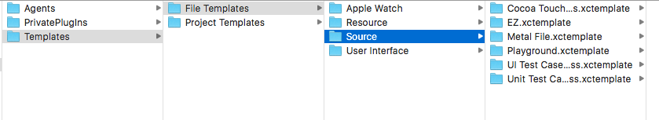
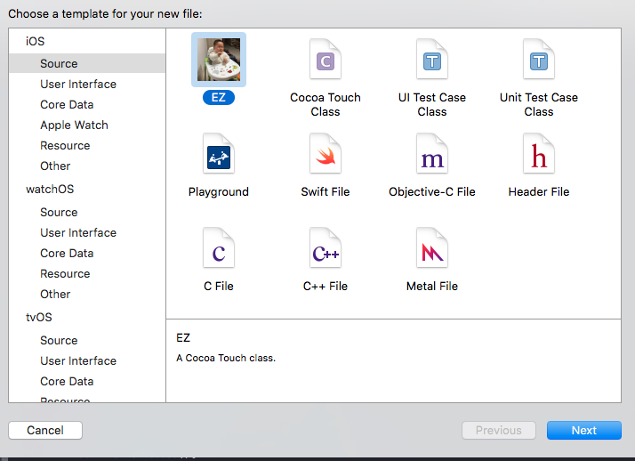
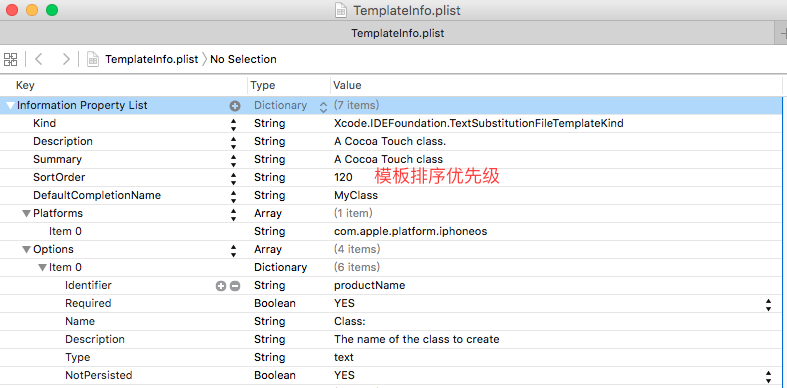
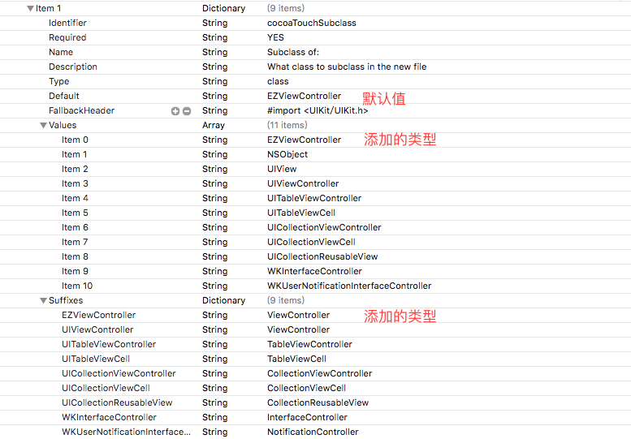
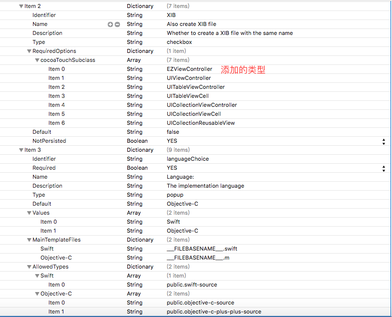
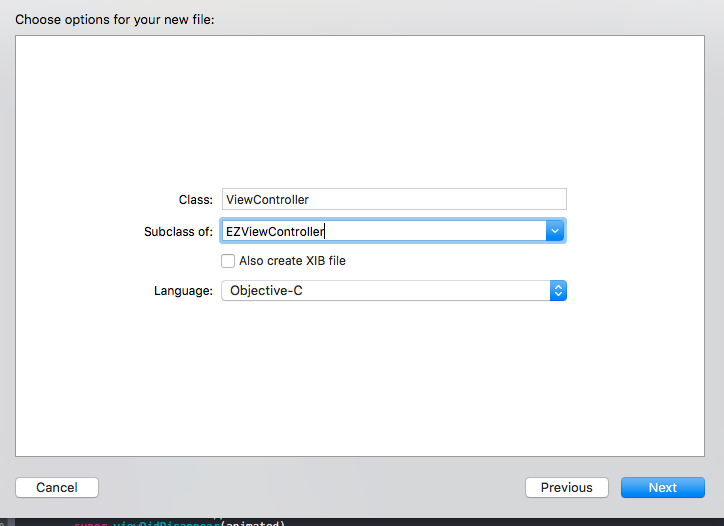

# XcodeTemplates
File Templates &amp; Project Templates
***
## 文件模板
* 系统文件模板路径（Xcode7）:

    /Applications/Xcode.app/Contents/Developer/Library/Xcode/Templates/File Templates

EZ.xctemplate 是我放进入的文件模板（其实只要复制 Cocoa Touch Class.xctemplate模板修改定制成自己的模板），你只要复制EZ.xctemplate到系统文件模板路径下就可以直接使用了。

EZ.xctemplate 文件夹下的EZViewControllerObjective-C，EZViewControllerXibObjective-C，EZViewControllerSwift，EZViewControllerXIBSwift是我增加的文件夹，

UIViewControllerObjective-C，UIViewControllerXIBObjective-C，UIViewControllerSwift，UIViewControllerXIBSwift文件夹做了定制修改。

TemplateIcon.png，TemplateIcon@2x.png，TemplateInfo.plist也做了相应的修改，其它暂时没有定制，

效果如下：

EZViewControllerObjective-C，EZViewControllerXibObjective-C，EZViewControllerSwift，EZViewControllerXIBSwift 文件夹命名规则是：类名+Objective-C/Swift 如果文件夹下有xib文件，在Objective-C/Swift前加Xib

TemplateIcon.png和TemplateIcon@2x.png是模板的icon，大小48\*48和96\*96

TemplateInfo.plist是模板的配置文件：

Options中得Item0、1、2、3对应下图四个选项：

模板代码例子（EZ.xctemplate/EZViewControllerSwift/___FILEBASENAME___.swift）：

    //
    //  ___FILENAME___
    //  ___PROJECTNAME___
    //
    //  Created by ___FULLUSERNAME___ on ___DATE___.
    //___COPYRIGHT___
    //

    import UIKit

    class ___FILEBASENAMEASIDENTIFIER___: ___VARIABLE_cocoaTouchSubclass___ {

    // MARK: - Life cycle
    required init?(coder aDecoder: NSCoder) {
        fatalError("init(coder:) has not been implemented")
    }
    
    
    override func awakeFromNib() {
        super.awakeFromNib()
    }
    
    override init(nibName nibNameOrNil: String?, bundle nibBundleOrNil: NSBundle?) {
        super.init(nibName: nil, bundle: nil)
    }
    
    override func viewDidLoad() {
        super.viewDidLoad()
        
        // Do any additional setup after loading the view.
    }
    
    override func viewWillAppear(animated: Bool) {
        super.viewWillAppear(animated)
    }
    
    override func viewDidLayoutSubviews() {
        super.viewDidLayoutSubviews()
    }
    
    override func viewDidAppear(animated: Bool) {
        super.viewDidAppear(animated)
    }
    
    override func viewWillDisappear(animated: Bool) {
        super.viewWillDisappear(animated)
    }
    
    override func viewDidDisappear(animated: Bool) {
        super.viewDidDisappear(animated)
        
    }
    
    
    override func didReceiveMemoryWarning() {
        super.didReceiveMemoryWarning()
        // Dispose of any resources that can be recreated.
    }
    
    deinit{
        NSNotificationCenter.defaultCenter().removeObserver(self)
        if self.isViewLoaded(){
            self.view.layer .removeAllAnimations();
        }
    }
    
    // MARK: - Config
    // MARK: - Public methods
    // MARK: - Private methods
    // MARK: - Target
    // MARK: - Action
    // MARK: - Notification

    }

***
## 项目模板
自带的iOS项目模板存放在/Applications/Xcode.app/Contents/Developer/Platforms/iPhoneOS.platform/Developer/Library/Xcode/Templates/Project Templates/, 
自定义的模板应该放在 ~/Library/Developer/Xcode/Templates/Project Templates/. 

打开Xcode自带的模板可以看到，每个模板都是一个以xctemplate为后缀的文件夹，每个文件夹下都有一个TemplateInfo.plist的文件，这个文件用来描述模板的各项信息，Xcode会根据此文件来生成模板。我们所说的自定义模板，其实就是配置这个文件。

TemplateInfo.plist实质上就是一个XML文件，通过定义相关的键值来配置模板。这里列出比较重要的key：

**Identifier**

每个模板的唯一ID，比如苹果自带的com.apple.dt.unit.singleViewApplication

**Ancestors**
模板可以继承，可以在此声明需要继承的模板ID。

**Concrete**
用来标识是否显示在新建模板的窗口中。

**Definitions**

用来定义需要引入的文件、代码，也可以在此定义文件夹和Group。与Nodes结合使用。 如下例：

     <key>Definitions</key>

     <dict>

     <key>Classes/AppDelegate/.gitkeep</key>
    
	 <dict>
	
        <key>Path</key>
        
		<string>gitkeep</string>
		
        <key>Group</key>
        
        <string>AppDelegate</string>
        
    </dict>
    
    </dict>

第二个<key> 是这个定义的标识，在此例中定义了.gitkeep文件的路径，在Class/AppDelegate/下。

Path定义了这个文件的来源，此例即模板文件夹下的gitkeep文件，相当于把模板中的gitkeep复制到了Class/Appdelegate/下。

Group则定义了这个文件在Xcode项目中的所属Group。目前我还没有找到可以定义一个空的Group的方法。只定义Group的话，Xcode生成模板的时候会自动在该Group下生成一个同名的空文件。

如果要定义多层的Group,可以这么做：

    <key>Definitions</key>
    <dict>
    <key>Classes/SomeClass/SomeClass.m</key>
    <dict>
	<key>Group</key>
	    <array>
		    <string>Classes</string>
		    <string>SomeClass</string>
	    </array>
	<key>Path</key>
	<string>Classes/SomeClass/SomeClass.m</string>
    </dict>
    </dict>

**Description**

模板的描述,如果该模板会显示在新建工程的窗口中，则窗口的下方会显示这个描述。

**Kind**

设置成 Xcode.Xcode3.ProjectTemplateUnitKind。

**Nodes**

在此输入 Definitions 中的key值，决定模板需要引入的文件和代码。

**Options**

提供 popup、checkbox、text、combo 控件，用以在新建工程的时候，提供下拉框、单选框、文本框等,并定义相应操作。

**Platforms**

iOS的设置为 com.apple.platform.iphoneos。

**Project**

设置Bulid Settings

**Targets**

在此添加Framworks、Libraries、Buid Phases、Build Settings.

